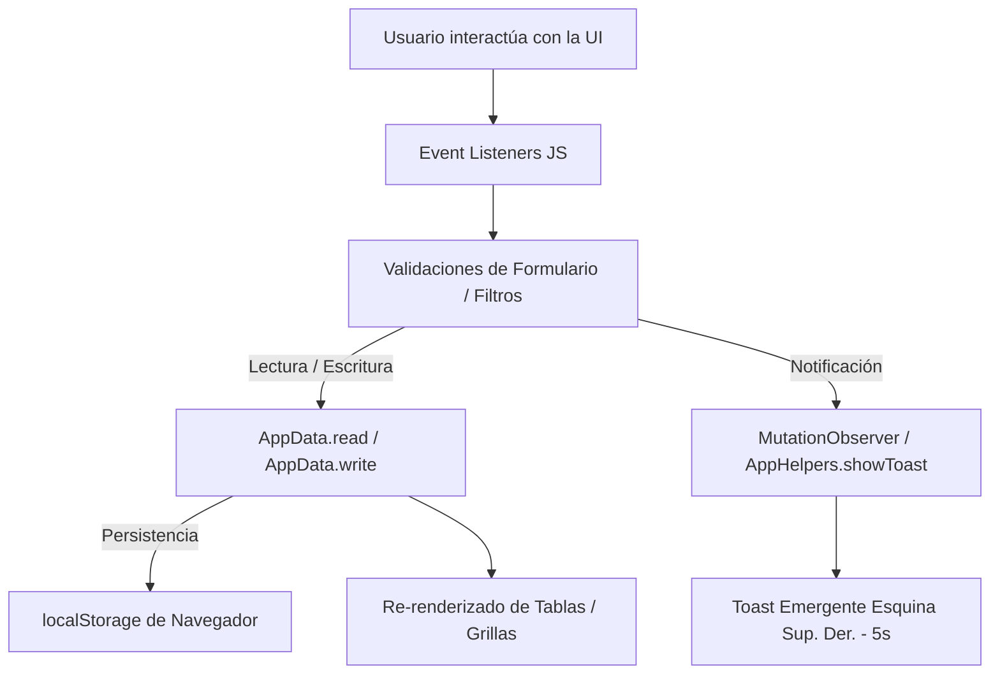

# Guía General del Sistema - Salud Turnos (TP2)

Este documento contiene la documentación completa de la estructura del proyecto, la explicación detallada de cada archivo y la guía de todas las funciones JavaScript utilizadas en la aplicación.

---

## 📁 1. Estructura General del Proyecto

```
Practico2/
├── index.html          # Página pública de bienvenida e inicio
├── login.html          # Pantalla de inicio de sesión
├── dashboard.html      # Panel principal con indicadores y próximos turnos
├── pacientes.html      # Gestión de pacientes (alta, búsqueda y tabla)
├── turno.html          # Solicitud y cancelación de turnos
├── agenda.html         # Visualización de disponibilidad médica por profesional
├── css/
│   └── styles.css      # Hoja de estilos principal (Design System, Responsive y Toasts)
├── js/
│   ├── data.js         # Mock data, localStorage, AppData y sistema de Toasts flotantes
│   ├── common.js       # Control de sesión, menú móvil y helpers de formato
│   ├── login.js        # Validación e inicio de sesión
│   ├── dashboard.js    # Cálculo de estadísticas y renderizado del panel
│   ├── pacientes.js    # Lógica de alta y búsqueda en tiempo real de pacientes
│   ├── turnos.js       # Selección en cascada, validación de horarios y cancelación
│   └── agenda.js       # Matriz de disponibilidad por horario (LIBRE / OCUPADO)
└── GUIA.md             # Esta guía de documentación
```

---

## 🎨 2. Arquitectura de Estilos y Responsive (`css/styles.css`)

- **Variables CSS (`:root`)**: Centraliza los colores primarios (`--navy`, `--blue`), alertas (`--danger`, `--success`), alturas de layout (`--topbar-height: 58px`), anchos (`--sidebar-width: 210px`) y sombras.
- **Sidebar de Altura Constante**:
  - Implementado mediante `position: sticky; top: var(--topbar-height); height: calc(100vh - var(--topbar-height));`.
  - Garantiza que el menú lateral mantenga **siempre la misma altura visible en la pantalla**, sin importar si el contenido de la página se extiende hacia abajo.
  - El botón **Cerrar sesión** (`.nav-button`) utiliza `margin-top: auto`, por lo que queda congelado en la parte inferior del sidebar visible sin requerir scroll.
- **Menú Móvil Desplegable (Drawer)**:
  - En pantallas `<=` 768px, el sidebar se transforma en un panel emergente controlado por el botón hamburguesa (`.mobile-menu-btn`).
- **Notificaciones Flotantes (Toasts)**:
  - Estilizadas mediante `.toast-container` fijado en la esquina superior derecha (`position: fixed; top: 74px; right: 20px; z-index: 10000;`).
  - Animación de entrada (`toastSlideIn`) y salida en 5 segundos.

---

## ⚙️ 3. Explicación Detallada de Funciones y Módulos JavaScript

### 🟢 `js/data.js` (Almacenamiento y Notificaciones Globales)

Proporciona los datos iniciales y la persistencia en `localStorage` a través del objeto `AppData`, además de implementar el sistema global de notificaciones emergentes `AppHelpers.showToast`.

| Función / Método | Descripción y Uso |
| :--- | :--- |
| `AppData.read(key)` | Lee una colección (`'patients'`, `'turns'`, etc.) de `localStorage`. Si no existe, guarda los datos iniciales por defecto y los devuelve. |
| `AppData.write(key, value)` | Guarda una colección completa en `localStorage` convirtiéndola a JSON. |
| `AppHelpers.showToast(message, type, duration)` | **Notificación Flotante**: Crea una tarjeta emergente en la esquina superior derecha con ícono (✓, ✕, ℹ), mensaje y botón de cierre. Se oculta automáticamente a los 5 segundos (5000ms). |
| `initToastObserver()` | **MutationObserver**: Escucha los cambios de texto en los elementos de mensajes estáticos (`#turnMessage`, `#patientMessage`, `#loginMessage`, `.form-message`), los oculta y dispara automáticamente la notificación flotante `showToast`. |

---

### 🔵 `js/common.js` (Control de Sesión, Menú Móvil y Formateadores)

Se ejecuta en todas las pantallas privadas (`dashboard`, `pacientes`, `turno`, `agenda`).

| Función / Elemento | Descripción y Uso |
| :--- | :--- |
| **Control de Sesión** | Verifica la clave `saludturnos_user` en `sessionStorage`. Si no existe, redirige inmediatamente a `login.html`. |
| **Botón `#logoutBtn`** | Evento `click` que elimina la sesión en `sessionStorage` y redirige al inicio de sesión. |
| `initMobileMenu()` | Controla la apertura/cierre del menú lateral en dispositivos móviles/tablets y desactiva el scroll del body cuando el menú está abierto. |
| `AppHelpers.patientName(patient)` | Devuelve el nombre completo del paciente (`"Nombre Apellido"`) o un mensaje por defecto si no está disponible. |
| `AppHelpers.doctorName(doctor)` | Devuelve el nombre del profesional médico. |
| `AppHelpers.statusBadge(status)` | Genera la etiqueta HTML con las clases CSS correspondientes (`badge confirmado`, `badge pendiente`, `badge cancelado`). |

---

### 🟡 `js/login.js` (Autenticación de Usuarios)

Controla el formulario de inicio de sesión en `login.html`.

| Función / Evento | Descripción y Uso |
| :--- | :--- |
| `clearErrors()` | Restablece los mensajes de error de email y contraseña. |
| `loginForm.submit` | Valida que los campos no estén vacíos, busca coincidencias en `AppData.defaults.users` y, si es correcto, crea la sesión en `sessionStorage` y redirige a `dashboard.html`. Si es incorrecto, actualiza `#loginMessage` para disparar el Toast de error. |

---

### 🟣 `js/dashboard.js` (Panel Principal)

Actualiza los contadores de la parte superior y la tabla de resumen.

| Acción / Lógica | Descripción y Uso |
| :--- | :--- |
| **Contadores** | Actualiza en el DOM los elementos `#totalTurnos`, `#confirmados` y `#cancelados` filtrando el arreglo de turnos. |
| **Tabla Próximos Turnos** | Filtra los turnos que no estén cancelados, los ordena cronológicamente por fecha y hora, toma los primeros 5 y genera las filas dentro de `#dashboardTurnos`. |

---

### 🟠 `js/pacientes.js` (Gestión de Pacientes)

Permite registrar pacientes y realizar búsquedas en tiempo real.

| Función / Evento | Descripción y Uso |
| :--- | :--- |
| `renderPatients(filter)` | Recorre el arreglo de pacientes y dibuja las filas de la tabla. Permite filtrar por DNI, nombre o apellido. |
| `clearFormErrors()` | Limpia los mensajes de error de los campos del formulario. |
| `toggleForm(show)` | Muestra u oculta la tarjeta del formulario (`#patientFormCard`) utilizando la clase `.hidden`. |
| `patientForm.submit` | Valida DNI (obligatorio y no duplicado), nombre, apellido y formato de correo electrónico. Genera un nuevo ID correlativo, guarda en `localStorage` y dispara el Toast de confirmación. |
| `patientSearch.input` | Evento en tiempo real que ejecuta `renderPatients` a medida que el usuario escribe en el buscador. |

---

### 🔴 `js/turnos.js` (Solicitud y Cancelación de Turnos)

Maneja la lógica de selección en cascada y validación de horarios libres.

| Función / Evento | Descripción y Uso |
| :--- | :--- |
| `fillPatients()` | Carga en el `<select>` de pacientes únicamente aquellos que tengan estado activo. |
| `fillSpecialties()` | Llena el selector con las especialidades disponibles (Clínica médica, Pediatría, Cardiología). |
| `fillDoctors()` | Filtra los profesionales médicos según la especialidad seleccionada. |
| `fillHours()` | Calcula los horarios disponibles descartando aquellos que ya estén ocupados por un turno activo (diferente de Cancelado) para ese profesional y fecha. |
| `renderTurns()` | Genera la tabla de turnos registrados ordenados por fecha y hora, incluyendo el botón de cancelación. |
| `turnForm.submit` | Valida que todos los campos requeridos estén seleccionados, realiza una segunda verificación de disponibilidad para evitar superposiciones y registra el turno. |
| `table.click` (Delegación) | Escucha los clics en los botones con `data-cancel-id`, cambia el estado del turno a `'Cancelado'`, persiste en `localStorage` y actualiza la tabla y horarios libres. |

---

### 🔵 `js/agenda.js` (Agenda Médica de Disponibilidad)

Permite consultar la grilla diaria de un profesional.

| Función / Evento | Descripción y Uso |
| :--- | :--- |
| `renderAgenda()` | Compara la lista completa de horarios del sistema contra los turnos agendados para la fecha y profesional seleccionados. Muestra cada bloque como `LIBRE` (en azul) u `OCUPADO` (en amarillo con el nombre del paciente). |
| `dateInput / doctorSelect` | Al cambiar la fecha o el profesional, se reejecuta `renderAgenda()` automáticamente. |

---

## 🚀 4. Resumen de Flujo de Datos


